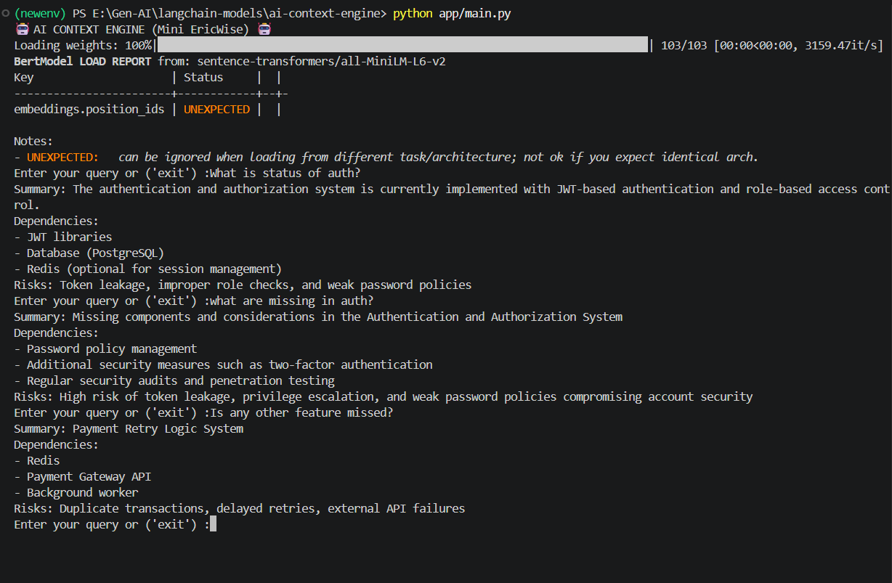

Screenshots Demo:

_______________________________________________________________________________________________________________________
# AI Context Engine (Mini EpicWise)

A backend-focused Retrieval Augmented Generation (RAG) system that converts engineering context into structured technical insights.

---

## Features

* Document ingestion and chunking
* Embedding generation using HuggingFace
* Vector storage with Pinecone
* Semantic retrieval (top-k search)
* LLM-based response generation
* Structured output using Pydantic

---

## Tech Stack

* Python
* LangChain (LCEL)
* HuggingFace (LLM + Embeddings)
* Pinecone (Vector DB)
* Pydantic

---

## Project Structure

```
app/
 ├── models/          # Pydantic schema
 ├── prompts/         # Prompt templates
 ├── embeddings/      # Embedding model
 ├── vectorstore/     # Pinecone setup
 ├── retriever/       # Retrieval logic
 ├── chains/          # RAG pipeline
 ├── services/        # Business logic
 ├── loaders/         # Document loader
 ├── splitters/       # Text splitting
 ├── main.py          # CLI app
 ├── ingest.py        # Data ingestion
```

---

## Setup

1. Clone repo and install dependencies

```
pip install -r requirements.txt
```

2. Create `.env` file

```
HUGGINGFACEHUB_API_TOKEN=your_token
PINECONE_API_KEY=your_key
```

---

## Run

### Step 1: Ingest data

```
python app/ingest.py
```

### Step 2: Run app

```
python app/main.py
```

---

## Example Query

```
What is authentication system?
```

---

## Output

* Summary
* Dependencies
* Risks

---

## Notes

* Ensure embedding dimension matches Pinecone index
* Run ingestion before querying
* Designed with modular backend architecture

---

## Future Improvements

* FastAPI integration
* Agent-based workflows
* Hybrid search (keyword + vector)
* Query classification

---
